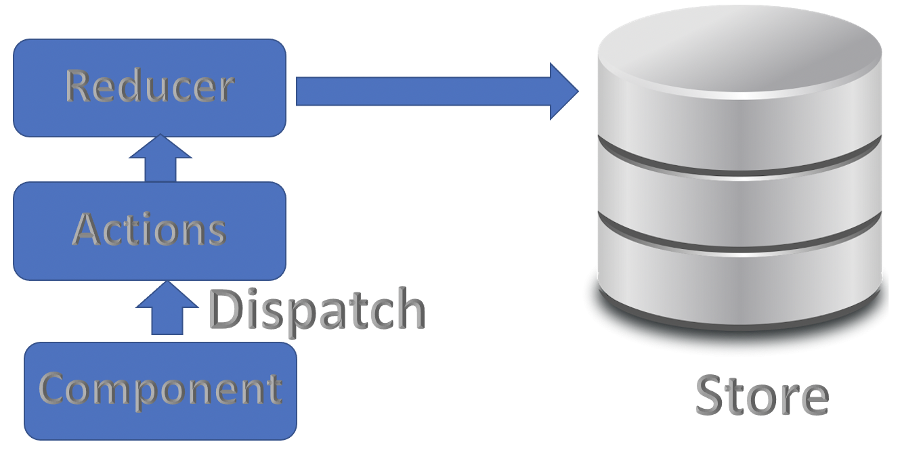
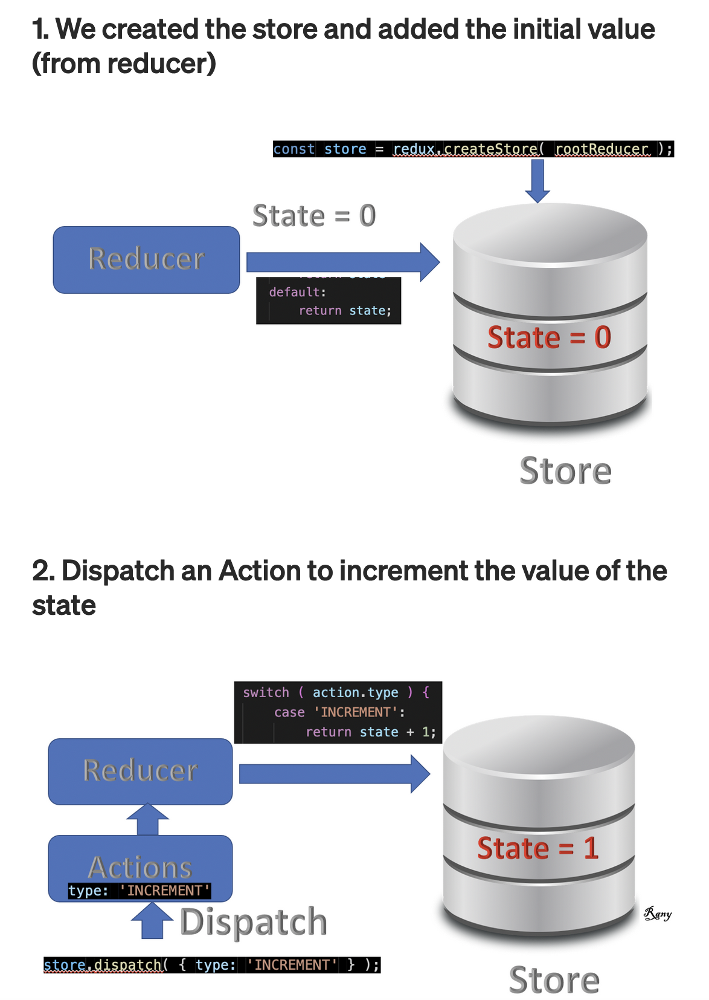

### What is Redux?


1. create react sample app `npx create-react-app demo-app`
2. install redux - `npm install --save redux`
    1. `Redux is a stand-alone library. Here we are installing only redux.`
3. create js file to have redux code
4. import redux - `const redux = require('redux');`
5. Create a basic reducer
    ```
    const rootReducer = ( currentState = 0, action ) => { 
        return currentState;
    };
    ```
6. Create a store
    ```
        const store = redux.createStore( rootReducer );
    ```
7. State has many methods and one of them is getState that returns current state.
    ```
    console.log( "Initial state: ", store.getState() );
    
    //Output:: 0 ---> current state as of now
    ```
8. Add reducer actions
    ```
    const rootReducer = ( currentState = 0, action ) => { 

        switch (action.type ) {
            case 'ADDITION':
                return currentState + 1;
            case 'SUBSTRACTION':
                return currentState - 1;
            default:
                return currentState;
        }
    };    
    ```
9. dispatch actions
    ```
    store.dispatch({ type:'INCREMENT' });

    console.log( "current state after Increment action: ",store.getState() ); 
    
    //Output:: 1 ---> current state as of now
    ```
10. Usually, it takes a type and a Payload. But for simplicity, I will only pass a type for now. Of course in real life, the state will be a more complex object with multiple values and nested objects but this is the overall idea
3. End to End Flow Diagram


