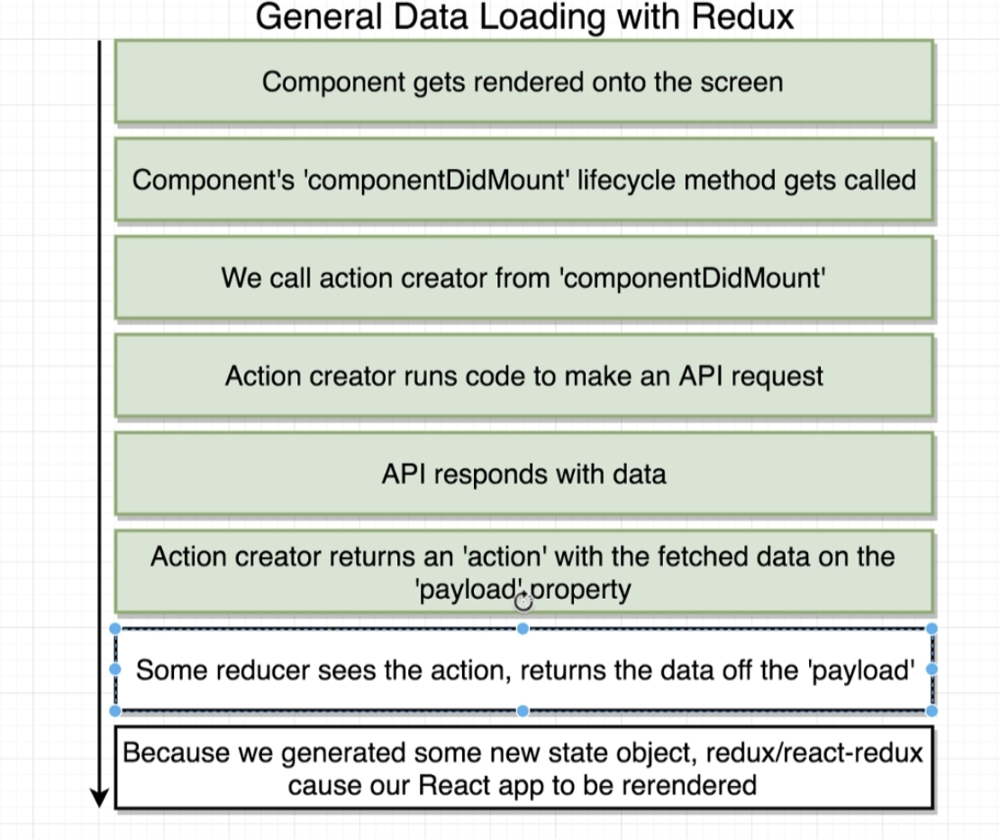

## Overview

## Setup

## Container & Presentational Components

## Connect API

## Data and Events

## mapStateToProps - Maps States Data to Presentation Compoent Props

## mapDipatchToProps - Dispatches Evenets to Actions along with Event Data

## Mapping Summary

## Context

## Data Loading Witrh Redux

## Rule of Reducers

## Examples of Visualizing Changes

