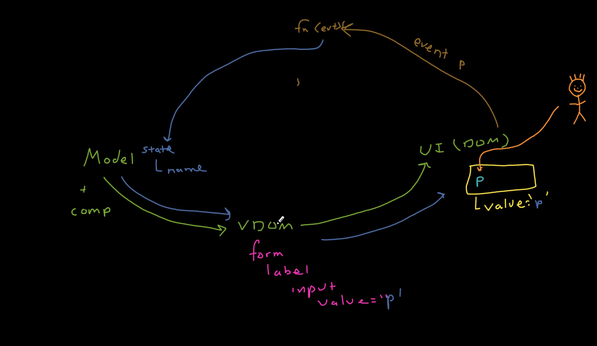

### Setup
1. Install [NVM](https://github.com/nvm-sh/nvm)
2. Install [Node]
3. Manage NVM to switch Node versions
    1. nvm install 16
    2. nvm use 16
    3. node -v ----- `should be 16.xx.xx`
4. Create Demo React App - `npx create-react-app demo-app`
5. Go to demo-app folder - `cd demo-app`
5. Run Demo App - `npm start`

### Demo App Code Overview
1. node-modules - 3rd party libs
2. public - index.html (root div)
3. src/index.js
    1. `ReactDOM.render` or `render`
4. package.json - browserList tells what browesers to use
    ```
    "browserslist": {
      "production": [
        ">0.2%",
        "not dead",
        "not op_mini all"
      ],
      "development": [
        "last 1 chrome version",
        "last 1 firefox version",
        "last 1 safari version"
      ]
    }
    ```  
5. Compoenents Types
    1. Function Declaration
        ```
        function HelloWorld() {}
        ```
    2. Function Expression
        ```
        const HellowWorld2 = function() {}
        ```
    3. Arrow Function
        ```
        const HelloWorld3 = () => {
        
        // JSX, its not a string of html, its a function call, its not valid JS, no need to add jsx extention
        
        //bable converts it into valid js React.createElement('h1', null, 'Hello, World!');
        
        return <h1>Hello, World!</h1>; // JSX, its not a string of html, its a function call, its not valid JS
        
        }
        ```
6. Inspector Mode and see root being updated with our contents

7. Export

8. Components Props
  1. props are frozsen object and we cannot modify them - `Object.isFrozen(props) --> True`
  2. 
8. Props State Management  
  
  
  