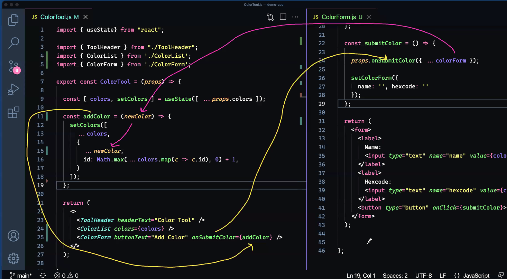

### Day 2 Notes
1. Forms always have input in the form of string even we set type as number but we can check `[e.target.name]: e.target.value === 'number' ? parseInt(e.target.value, 10) : e.target.value` ..... interger 10 converts it to base 10

2. importing css `import './index.css'` --> incklude as part of build process

3. Block Model --- label is the sleector and each label will take whole width
    ```
    label {
        display: block;
        padding: 2px;
    }
    ```

4. Form + State Management
    ```
    const [colorForm, setColorForm] = useState({
        name: '',
        hexcode: ''
    });

    const [colors, setColors] = useState([...props.colors]);

    const addColor = () => {

        //add new color
        setColors([
            ...colors,
            {
                ...colorForm,
                //id: colors.length +1 //if you delete things, you will have duplicates
                id: Math.max(...colors.map(c => c.id), 0) +1,     
            }
        ]);

        //clear the form
        setColorForm({
            name: '', hexcode: ''
        });
    };

    ```

5. register prop types and register with package.json
    ```
    npm install prop-types
    ```

6. generally default import (import eveerything from the module), very bad thing to do and better to be specific. Typechecking With PropTypes – React (reactjs.org). `Its just a development tooling thing and in prod its not even checked as it slows down react.`
    ```
        //default props are react specific thing and not js
        ToolHeader.defaultProps = {
            headerText: "The Tool",
        }

        ToolHeader.propTypes = {
            headerText: PropTypes.string.isRequired,
        }    
    ```

7. when to use default props, better to use for array as if not passed than fucntions like map, filter etc. will fail so defaultprops will ste empty array

8. You need to set `key=` for dynamically generated stuff `{props.cars.map( car => <CarRow key={car.id} car={car} /> )}`

9. CallBack Flow


10. 


## Day3
1. earlier react versions, only way to mantain states b/w fucntions is via class components. Instance of the class based components have state data + render logic
2. FiberNodes
    1. React decouples state management with rendering logic. State does not have to be stored with components
    2. create component with render method --> state data with element and element data with VDOM (element in VDom is called FiberNode).
    3. All we have to dupply is the render logic
    4. Hook them together with State Hooks --> Linkedlist of state data with FiberNode in VDom
        1. FiberNode -> memoisedState -> state data + next
3. Sorting
```
const nameSortDesc = (a,b) => { if (a.name > b.name) return -1; if (a.name < b.name) return 1; return 0; };

const nameSort = (a,b) => { if (a.name > b.name) return 1; if (a.name < b.name) return -1; return 0; };

const people = [ {name:'Bob'}, {name:'Abe'}, {name:'Sally'}]

people.sort(nameSortDesc)

people.sort(nameSort)
```