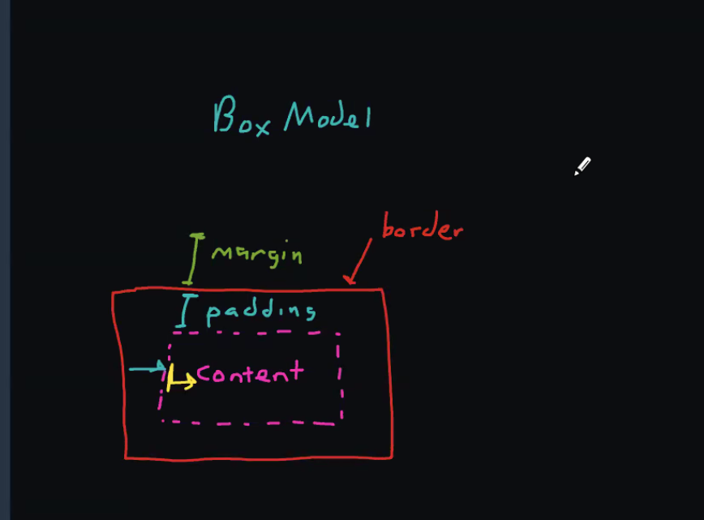

### Day 2 Notes
1. Forms always have input in the form of string even we set type as number but we can check `[e.target.name]: e.target.value === 'number' ? parseInt(e.target.value, 10) : e.target.value` ..... interger 10 converts it to base 10

2. importing css `import './index.css'` --> incklude as part of build process

3. Block Model --- label is the sleector and each label will take whole width
    ```
    label {
        display: block;
        padding: 2px;
    }
    ```

4. Form + State Management
    ```
    const [colorForm, setColorForm] = useState({
        name: '',
        hexcode: ''
    });

    const [colors, setColors] = useState([...props.colors]);

    const addColor = () => {

        //add new color
        setColors([
            ...colors,
            {
                ...colorForm,
                //id: colors.length +1 //if you delete things, you will have duplicates
                id: Math.max(...colors.map(c => c.id), 0) +1,     
            }
        ]);

        //clear the form
        setColorForm({
            name: '', hexcode: ''
        });
    };

    ```

5. register prop types and register with package.json
    ```
    npm install prop-types
    ```

6. generally default import (import eveerything from the module), very bad thing to do and better to be specific. Typechecking With PropTypes – React (reactjs.org). `Its just a development tooling thing and in prod its not even checked as it slows down react.`
    ```
        //default props are react specific thing and not js
        ToolHeader.defaultProps = {
            headerText: "The Tool",
        }

        ToolHeader.propTypes = {
            headerText: PropTypes.string.isRequired,
        }    
    ```

7. when to use default props, better to use for array as if not passed than fucntions like map, filter etc. will fail so defaultprops will ste empty array

8. You need to set `key=` for dynamically generated stuff `{props.cars.map( car => <CarRow key={car.id} car={car} /> )}`

9. CallBack Flow


10. 


## Day3
1. earlier react versions, only way to mantain states b/w fucntions is via class components. Instance of the class based components have state data + render logic
2. FiberNodes
    1. React decouples state management with rendering logic. State does not have to be stored with components
    2. create component with render method --> state data with element and element data with VDOM (element in VDom is called FiberNode).
    3. All we have to dupply is the render logic
    4. Hook them together with State Hooks --> Linkedlist of state data with FiberNode in VDom
        1. FiberNode -> memoisedState -> state data + next
3. Sorting
```
const nameSortDesc = (a,b) => { if (a.name > b.name) return -1; if (a.name < b.name) return 1; return 0; };

const nameSort = (a,b) => { if (a.name > b.name) return 1; if (a.name < b.name) return -1; return 0; };

const people = [ {name:'Bob'}, {name:'Abe'}, {name:'Sally'}]

people.sort(nameSortDesc)

people.sort(nameSort)
```


#### Day4
1. Store Pattern - Using Custom Hook
    1. A store is basically just a plain JavaScript object that allows components to share state.In a way, we can think of a store as a database. On the most fundamental level, both constructs allow us to store data in some form or another.
2. Custom Hook - uses to move state mamnagement and move it to a hook so that we can reuse 
3. Linters + Type Checkings
4. Object vs Array Destructuring
5. Model Data (Component Model Data)
    1. Props
    2. State
    3. props & state descrbiing the relationship b/w data & the components is defined as props & state
    4. Context
        1. easily abused
        2. its global scopped for the compoent tree
        3. 1 Provider & N Consumers
        4. Multiple Contexts


6. npm install react-router-dom / npm install react-router-dom@5
7. Router captures value of the location bar and pass it to the context
```
import { BrowserRouter as Router, Route, Link } from 'react-router-dom';

  <Router>
    <nav>
      <ul>
        <li><Link to="/">Home</Link></li>
        <li><Link to="/color-tool">Color Tool</Link></li>
        <li><Link to="/car-tool">Car Tool</Link></li>
      </ul>
    </nav>
    <Route path="/" exact>
      <h1>Home</h1>
    </Route>
    <Route path="/color-tool">
      <ColorToolStoreProvider colors={colorList}>
        <ColorTool />
      </ColorToolStoreProvider>
    </Route>
    <Route path="/car-tool">
      <CarToolStoreProvider cars={carList}>
        <CarTool />
      </CarToolStoreProvider>
    </Route>
  </Router>,
```

8. Reset CSS --- https://meyerweb.com/eric/tools/css/reset/
9. Flexbox Learning
    1. https://flexboxfroggy.com/
    2. https://cssgridgarden.com/
    3. https://css-tricks.com/introduction-fr-css-unit/



10.Redux
    1. State (cars, editCarId) ---> Selector (fn that selects data from the state) ---> UI (react) hooks/props ---> Action (type + payload) ---> Reducer (oldState, update ==> new State) --> State (goes back to start)

    2. Reducer never mutates ---> its a pure function (only input comes from parameters), parameters not mutated, pure functiona does not mutate

    3. Reducer generates new State
        1. Adding a car
        2. New Car
        3. Old Cars + New Car
        4. New Satte with updated cars

    4. Redux Store (Reducer + State (Data))
        1. Dispatching actions into the store ---> useDisptach Hook
        2. Subscribing to the Store (Selector) ---> useSelector Hook


### Day5
1. standard Redux app has only one store
2. npm install redux react-redux redux-thunk
3. Provider creates a context provided by react-redux
4. typing inpout fields we use local state and not redux
5. Sequence of things
    1. Create Actions
    ```
        //define list of actions calculator will do

        export const ADD_ACTION = "ADD";
        export const SUBSTRACT_ACTION = 'SUBTRACT';
        export const MULTIPLY_ACTION = 'multiply';
        export const DIVIDE_ACTION = 'divide';

        //function to produce payload for each action
        export const createAddAction = value => (
            { type: ADD_ACTION, payload: { value } }
        );

        export const createSubstractAction = value => (
            { type: SUBSTRACT_ACTION, payload: { value } }
        );

        export const createMultiplyAction = value => (
            { type: MULTIPLY_ACTION, payload: { value } }
        );

        export const createDivideAction = value => (
            { type: DIVIDE_ACTION, payload: { value } }
        );
    ```
    2. Create Reducers
    ```
        import { ADD_ACTION, SUBSTRACT_ACTION, MULTIPLY_ACTION, DIVIDE_ACTION } from "../actions/calcToolActions";


        //newstate = reducer (oldSatte, action)

        export const calcToolReducers = (state = {result: 0}, action) => {
            switch (action.type) {
                case ADD_ACTION:
                    return {
                        ...state,
                        result: state.result + action.payload.value,
                    }
                case SUBSTRACT_ACTION:
                    return {
                        ...state,
                        result: state.result - action.payload.value,
                    }
                case MULTIPLY_ACTION:
                    return {
                        ...state,
                        result: state.result * action.payload.value,
                }
                case DIVIDE_ACTION:
                    return {
                        ...state,
                        result: state.result / action.payload.value,
                }
                default:
                    return state; //return original state
            }

        };    
    ```
    3. Create Store
    ```
        import { createStore } from 'redux';

        import { calcToolReducers } from '../reducers/calcToolReducers';

        export const calcToolStore = createStore(calcToolReducers);
    ```
    4. Create Hook -- `useDispatch & useSelector hooks`
    ```
        import { useDispatch, useSelector } from "react-redux";
        import { bindActionCreators } from "redux";

        import {
            createAddAction, createSubstractAction, 
            createMultiplyAction, createDivideAction
        } from '../actions/calcToolActions';

        export const useCalcToolStore = () => {

            const result = useSelector(state => state.result);

            const disptach = useDispatch();
            const boundActions = bindActionCreators({
                add: createAddAction,
                subtract: createSubstractAction,
                multiply: createMultiplyAction,
                divide: createDivideAction,
            }, disptach);

            return {
                result,
                ...boundActions,
            }

        };    
    ```
    5. Crete React Component
    ```
        import { useState } from 'react';

        import {useCalcToolStore} from '../hooks/useCalcToolStore';

        export const CalcTool = () => {

            const {result, add, subtract, multiply, divide} =  useCalcToolStore();

            const [numInput, setNumInput] = useState(0);
            return (
                <div>
                    <section>
                        Result: {result}
                    </section>
                    <form>
                        <label>
                            Number:
                            <input type="text" value={numInput}
                                onChange={ ({target: {value}}) =>
                                    setNumInput(parseInt(value,10))} />
                        </label>
                        <fieldset>
                            <button type="button" 
                                onClick={() => add(numInput)}>+</button>
                            <button type="button" 
                                onClick={() => subtract(numInput)}>-</button>
                            <button type="button" 
                                onClick={() => multiply(numInput)}>*</button>
                            <button type="button" 
                                onClick={() => divide(numInput)}>/</button>
                        </fieldset>
                    </form>
                </div>
            );
        };
    ```
6. Redux combineRecuders - `dividing one big reducer into multiple reducers`

7. 