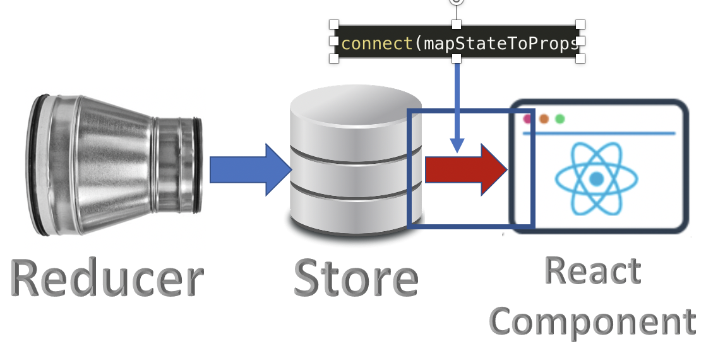

### Step By Step Guide to use Redux with React

1. Create a React App to start the project
    1. create demo app - `npx create-react-app redux-with-react`
    2. We will have to use a linking library to link both "react-redux". - `npm install react-redux --save`
    3. Test the app - `npm start`
    4. There are two main concepts in Redux
        1. Single Source of Truth (The store): We only store the state in one place. This is not a new concept it has been for decades in the industry.
        2. The Store is read-only.

        Therefore, the store has to be accessible from the top of the components. index.js is a good place to create the store and link Redux. Of course, it does not have to be on the same file but accessible there. 
2. Create the reducer and the store
    ```
    import { createStore } from 'redux';


    // 1. Create the reducer
    const reducer = ( state, action ) => {
    return state;
    }


    // 2. Create the store
    const store = createStore( reducer );    
    ```
3. With this step, we have Redux stand-alone and not linked to our React app

4. Link Redux (Store) to React. Now, comes the use of react-redux. Let's import it in index.js
    1. "Provider" is a helper component that links React to Redux and allows React components to access the Redux store. It has to wrap the parent component (in this case App) to be able to be used in all child components.
        ```
        import { Provider } from 'react-redux';
        .....
        ReactDOM.render(
            <Provider>
                <App />
            </Provider>,
            document.getElementById('root')
        );
        ```
    
    
5. Connect React components to the Store
    1. Here comes the fun part. We will be using "connect" from react-redux to connect any component to the store https://react-redux.js.org/api/connect. There are two parts to connect

        1. Read state from store: mapStateToProps
        2. dispatch and action: mapDispatchToProps
    2. `connect` is a `higher-order component (HOC)` that takes the React component and returns a new component with State in the props.
    3. Go to App.js and modify following.
        ```
        import './App.css';

        import { connect } from 'react-redux';

        function App() {
        return (
            <div className="App">
            <h1>Redux Hello World!</h1>
            </div>
        );
        }

        //The way connect works is to wrap it in the export part

        export default (connect)()(App);
        ```
    4. It will compile but will not do anything without mapping state to props. For that, let's create the function mapStateToProps and add it to connect. All that mapStateToProps does is to map state to any object item in the props of the current component.
    ```
        function App( props ) {
        console.log("props = ", props);
        return (
            <div className="App">
            <h1>Redux Hello World!</h1>
            <h3>State value from props: {props.stateValue}</h3>
            </div>
        );
        }

        const mapStatToProps = state => {
            return {
                stateValue: state,
            };
        };

        export default (connect)(mapStatToProps)(App);    
    ```
    
    
    
    
    


6. Changing the State
    1. We will dispatch an action to change the state value. 
    2. Let's add an action type to the reducer (`index.js`)
    ```
    // create reducer
    const reducer = ( state = 0, action) => {
        switch (action.type ){
            case 'ADD':
            return state + 1;
            default: 
            return state;
        }
    };
    ```
    3. Now, we can dispatch action.type = 'ADD' and this will add 1 to the currenr state. This time we will use `mapDispatchToProps`. We will do it in `App.js`
    ```
    const mapDispatchToProps = dispatch => {
    return {
        add : () => dispatch( {type: 'ADD'} )
    }
    };

    export default (connect)(mapStatToProps, mapDispatchToProps)(App);
    ```
    
    4. End to End flow
    
    <hr/>

    ### Redux Middleware
    1. DOM Event triggers --> DOM Event dispatch an action --> Middleware comes in that calls reducer --> reducer applies the logic based on the action type & updates the Redux state --> update in the store triggers re-render of DOM elemnent(s)
    2. What is the middleware?
    
    3. All of this magic is done by Redux when we call applyMiddleware.
    4. A valid middleware consists of 3 nested functions as follows
        1. The first function, takes the store as a parameter since it will work with the store.
        2. This first function will return a second function that takes "next" parameter, because it will be the next step to the reducer.
        3. the second function will return a third function that will receive an action as a parameter.
        ```
        // Logging Middleware
        const logging = ( store ) => {
            return ( next ) => {
                return ( action ) => {
                    console.log( "[inside logging],  action = ", action );
                    console.log( "[inside logging],  State before next = ", store.getState() );
                    const result = next( action ); //calling reducer
                    console.log( "[logging], store value after next", store.getState() );
                    return result;
                };
            };
        };
        ```
    5. Apply this middleware to the store to allow it to intercept the dispatched actions
        ```
        export const store = createStore( reducer, applyMiddleware(logging) );
        ```
    6. Famous middleware --- `Thunk`
        1. https://github.com/ranyelhousieny/ReactNativeFoodApplication
